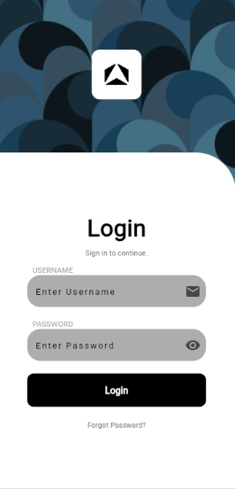
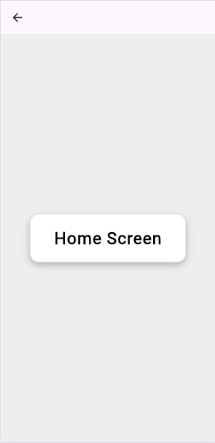

# Flutter Login App

A simple Flutter application built to demonstrate a basic login flow. This project fulfills the following requirements:

- A login screen with email and password fields.
- Navigation to a home screen after a successful login.
- Form validation for the email and password fields.

## Features Implemented

- **Login Screen:** A user interface with TextFormFields for email and password, a login button, and a "Forgot Password?" text.
- **Home Screen:** A second screen to demonstrate navigation.
- **Navigation:** `Navigator.push()` is used to navigate from the login screen to the home screen.
- **Form Validation:**
    - The email field is validated to ensure it follows a proper email format.
    - The password field is validated to ensure it is not empty.
- **UI Structure:** The UI is built using basic Flutter widgets like `Column`, `Row`, and `Container`.

## Screenshots

| Login Screen | Home Screen |
|---|---|
|  |  |

## Getting Started

To get a local copy up and running, follow these simple steps.

### Prerequisites

- Flutter SDK: Make sure you have the Flutter SDK installed on your machine. For more information, see the [Flutter documentation](https://flutter.dev/docs/get-started/install).
- An editor like Android Studio or VS Code with the Flutter plugin.

### Installation

1.  Clone the repo
    ```sh
    git clone https://github.com/your_username/flutter_login_app.git
    ```
2.  Navigate to the project directory
    ```sh
    cd flutter_login_app
    ```
3.  Install dependencies
    ```sh
    flutter pub get
    ```
4.  Run the app
    ```sh
    flutter run
    ```

## Project Structure

- `lib/main.dart`: The entry point of the application, which launches the `LoginScreen`.
- `lib/login_screen.dart`: Contains the UI and validation logic for the login screen.
- `lib/home_screen.dart`: A simple placeholder screen to navigate to after login.
- `pubspec.yaml`: Defines project dependencies and declares assets.
- `assets/images/`: This folder contains the images used in the application.
